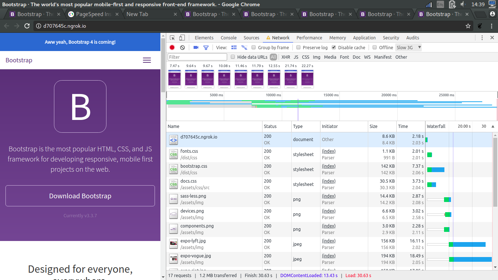
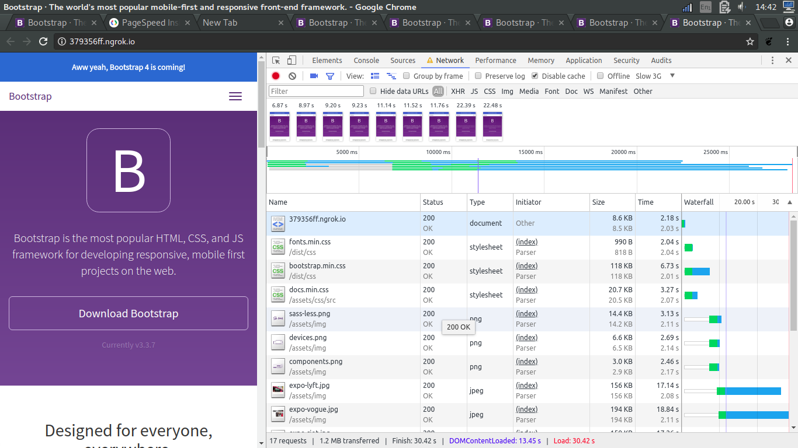

# Audit

## Step 1: Minifying css
I noticed that the CSS was blocking, so i decided to minify it and see the impact

Eerst:  
* Fonts.css 2.01s
* bootstrap.css 7.37s
* docs.css 3.73s
> First render 7.47s

* Fonts.min.css 2.04s(+0.03s)
* boostrap.min.css 6.753s
* docs.min.css 3.27s
>First render 6.87s

Er is dus best wel een gewin van het minifying van de css. 