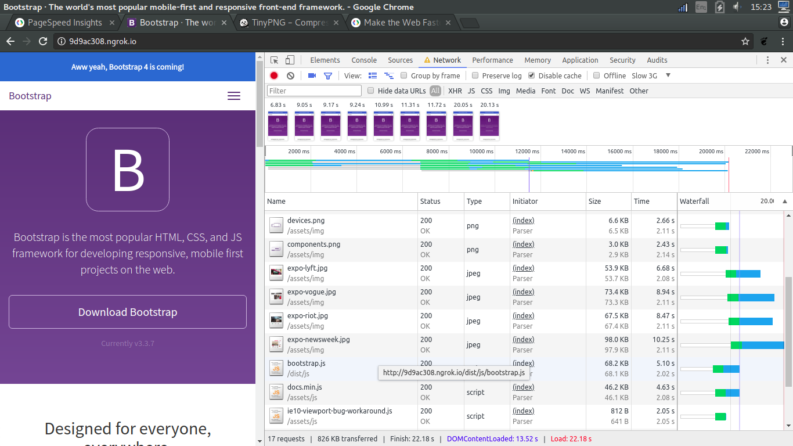
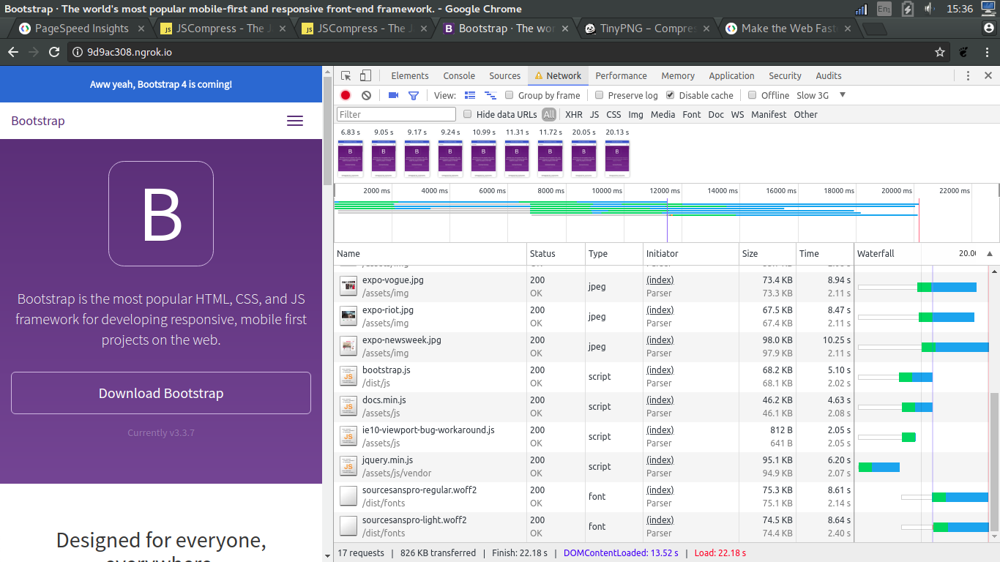
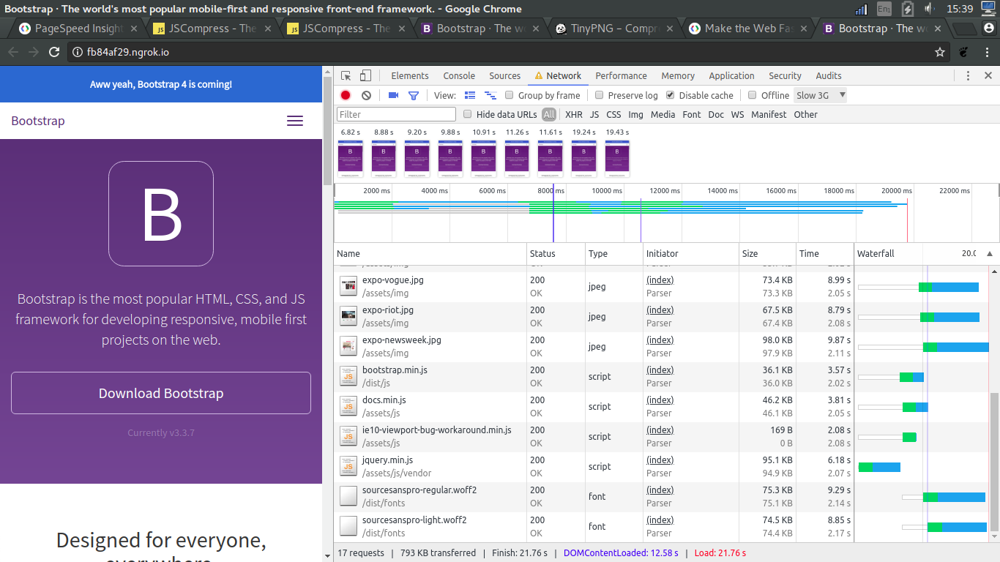

# Audit

## Step 1: Minifying css
I noticed that the CSS was blocking, and https://developers.google.com/speed/ indicated that minifying the css would improve the rendering

Statistics: 
* Fonts.css 2.01s
* bootstrap.css 7.37s
* docs.css 3.73s
> First render 7.47s

Statistics: 
* Fonts.min.css 2.04s(+0.03s)
* boostrap.min.css 6.753s
* docs.min.css 3.27s
> First render 6.87s

So, minifying the CSS had a positive impact on both the overall rendering as the initial render  

## Step 2: Minifying images
Tool used to minify: https://tinypng.com/

Statistics: 
* expo-lyft.jpg 2.08s
* expo-vogue.jpg 2.05s
* expo-riot.jpg 2.08s
* expo-newsweek.jpg 2.11s
> First render 6.87s
Total time: 30.34s  

Statistics:
* expo-lyft.jpg 2.11s
* expo-vogue.jpg 2.11s
* expo-riot.jpg 2.11s
* expo-newsweek.jpg 2.11s
> First render 6.83s
Total time: 22.18s  
This one i don't fully understand, even though the image times didn't go down drastically, the total time did. The render time also slightly improved. Not that relevant for the first render.

## Step 3: Minify javascript
Tool used to minify: https://jscompress.com/  

Statistics:
* bootstrap.js 2.02s 68.1KB
* ie10-viewport-bug-workaround.js 2.08s 641B
> First render 6.81s
Total time 22.18s

* bootstrap.js 2.02s 36.0KB
* ie10-viewport-bug-workaround.js 2.08s 0B
> First render 6.82s
Total time 21.76s 

Advise: For minification purposes, a NPM minifier is recommended. This way, all files should be minified without this requiring manual labor. Note that not all CSS or javascript files arent included, as these aren't within the audit scope. For this demo just the rendered files on the homepage are minified.  